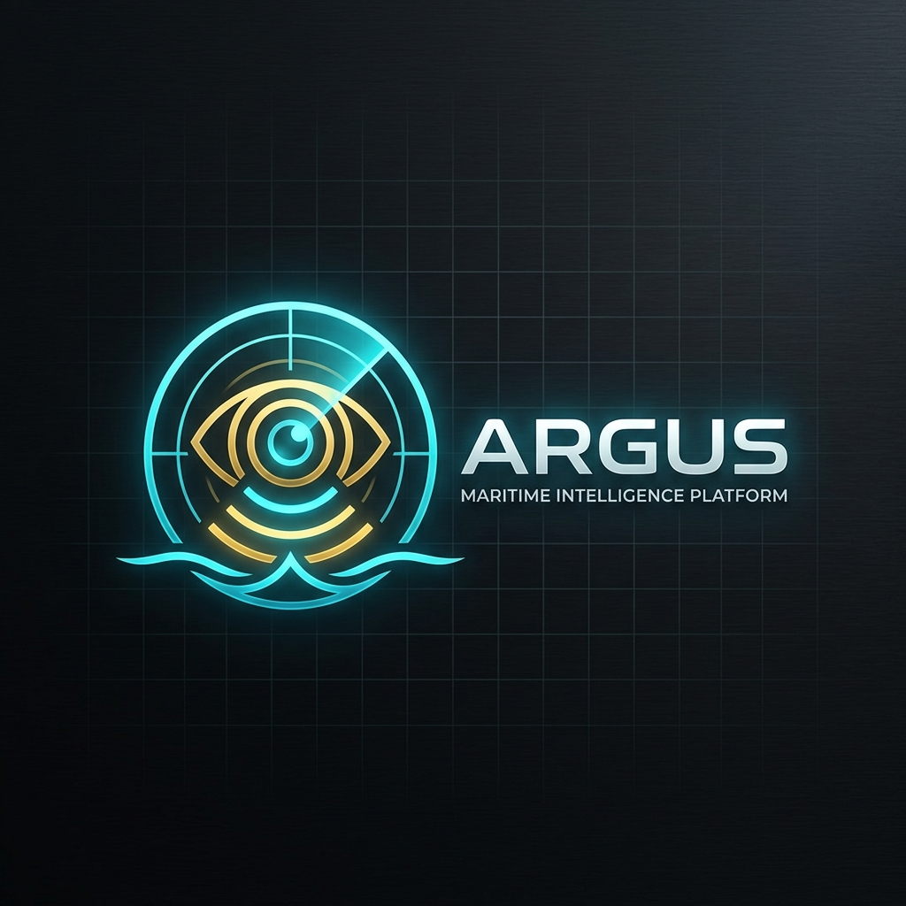
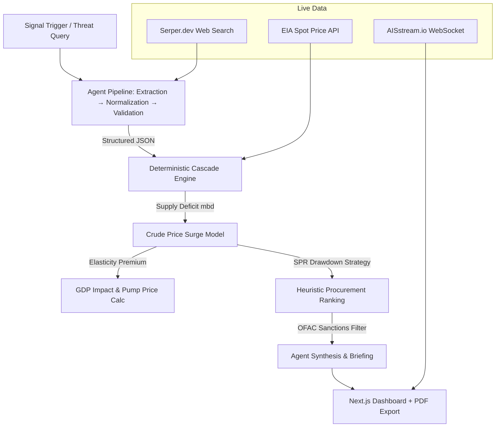

<div align="center">
  
  <h1>🛡️ ARGUS</h1>
  <p><strong>Deterministic Energy Supply Chain Resilience Engine & Intelligence Platform</strong></p>

  <p>
    
    
    
    
  </p>
</div>

---

## 📌 Strategic Overview
**ARGUS** is an advanced agentic intelligence platform built for **ET AI Hackathon 2026 — Problem Statement 2: AI-Driven Energy Supply Chain Resilience**. It enables geopolitical risk analysts and strategic decision-makers to model the cascading economic and supply-chain impacts of macro-level shocks to global maritime chokepoints (e.g., Strait of Hormuz, Bab el-Mandeb).

Rather than relying purely on generative LLM hallucinations, ARGUS utilizes a strict **Agentic-to-Deterministic Pipeline**: extracting unstructured threat signals, converting them to immutable mathematical states, computing real-world physics (SPR drawdowns, tanker lead times, elasticity-based price surges), and synthesizing the math back into a strategic intelligence briefing — all in under 6 seconds.

## ✨ Core Capabilities

### 🚢 Live Maritime Intelligence
*   **Real-time AIS Tracking:** Integrates `AISstream.io` websockets to map live vessel traffic inside critical disruption corridors (e.g., Fujairah anchorages).
*   **Dark Zone Profiling:** Actively correlates missing AIS data with IMF PortWatch to "own" AIS sparsity as a deliberate transponder-suppression finding.

### 🧠 Multi-Agent Fallback Architecture
*   **Primary Engine:** Powered by NVIDIA NIM (`meta/llama-3.1-70b-instruct`) for rapid, high-accuracy extraction.
*   **Resilience Failover:** If the primary AI engine faults or hallucinates (e.g., JSON markdown wrapping), ARGUS automatically falls back to Groq (`llama-3.3-70b-versatile`), ensuring the dashboard **never** crashes during a crisis simulation.

### 📉 Mathematical Cascade Engine
*   **Dynamic Elasticity Math:** Converts raw volume loss (`mbd`) into dynamic supply-shock premiums.
*   **Heuristic Procurement Ranking:** Evaluates global oil alternatives based on Landed Cost, Lead Time, and Sanctions compliance, re-routing supply chains instantly.

### 🕵️ D-SHIELD: Adversarial Audit System
*   Every intelligence claim generated by ARGUS is challengeable. Users can click any synthesized sentence to launch an adversarial LLM audit (D-SHIELD), verifying the claim against the underlying mathematical state and extracting live sources.

---

## ⚙️ System Architecture



---

## 🖥️ Dashboard Features

### Real-Time Signal Trigger
Submit disruption scenarios (e.g., "OPEC cuts production by 2mbd") via the signal panel. ARGUS timestamps the request and streams pipeline progress in under 6 seconds.

### Agent Transparency Terminal
Every pipeline stage — extraction, normalization, validation, transformation, synthesis — is streamed live with color-coded log lines and timestamps. Full observability into how each number is derived.

### Strategic Command Dashboard
Key metrics at a glance: **Cost Delta per day ($675M+)**, **Pump price surge (₹24.75/L)**, **SPR drawdown rates**, **Vulnerability Index per chokepoint**. Stacked area charts track supply deficits across crude, diesel, and gasoline.

### D-SHIELD Audit Layer
Click any intelligence claim to launch an adversarial audit. D-SHIELD traces the claim back to its source OPEC announcement, pipeline transform, and deterministic model version — with confidence scores.

### PDF Export
One-click export generates a comprehensive PDF report including the executive summary, disruption table, dashboard charts, and full pipeline trace for stakeholder review.

---

## 🚀 Installation & Deployment

### 1. Backend Setup (FastAPI)
Navigate to the backend directory and set up your virtual environment:

```bash
cd backend
python -m venv venv
source venv/Scripts/activate  # (Windows)
pip install -r requirements.txt
```

**Environment Variables (`backend/.env`):**
```env
NVIDIA_API_KEY=your_nvidia_key
GROQ_API_KEY=your_groq_key
SERPER_API_KEY=your_serper_key
EIA_KEY=your_eia_key
aistreamio_key=your_ais_key
```

**Run the Backend:**
```bash
uvicorn app.main:app --port 8000
```

### 2. Frontend Setup (Next.js)
Navigate to the frontend directory:

```bash
cd frontend
npm install
```

**Environment Variables (`frontend/.env.local`):**
```env
NEXT_PUBLIC_API_URL=http://127.0.0.1:8000
```

**Run the Frontend:**
```bash
npm run dev
```

The ARGUS Intelligence Dashboard will be accessible at `http://localhost:3000`.

---

## 🔒 Security & Resilience
* **API Protection:** All API keys are managed via environment variables (`backend/.env`). Live OSINT uses in-memory caching to prevent rate-limit exhaustion.
* **Multi-Agent Fallback:** Primary NVIDIA NIM (`llama-3.1-70b`) with automatic failover to Groq (`llama-3.3-70b-versatile`) if the primary faults.
* **Network Stability:** AIS WebSocket uses exponential backoff `while True` loops to survive server disconnections without dropping the client stream.
* **Data Integrity:** Strict regex filtering cleans markdown-wrapped JSON payloads from LLM responses.

> *"In geopolitical risk, confidence is nothing without calculation. ARGUS bridges the gap."*
