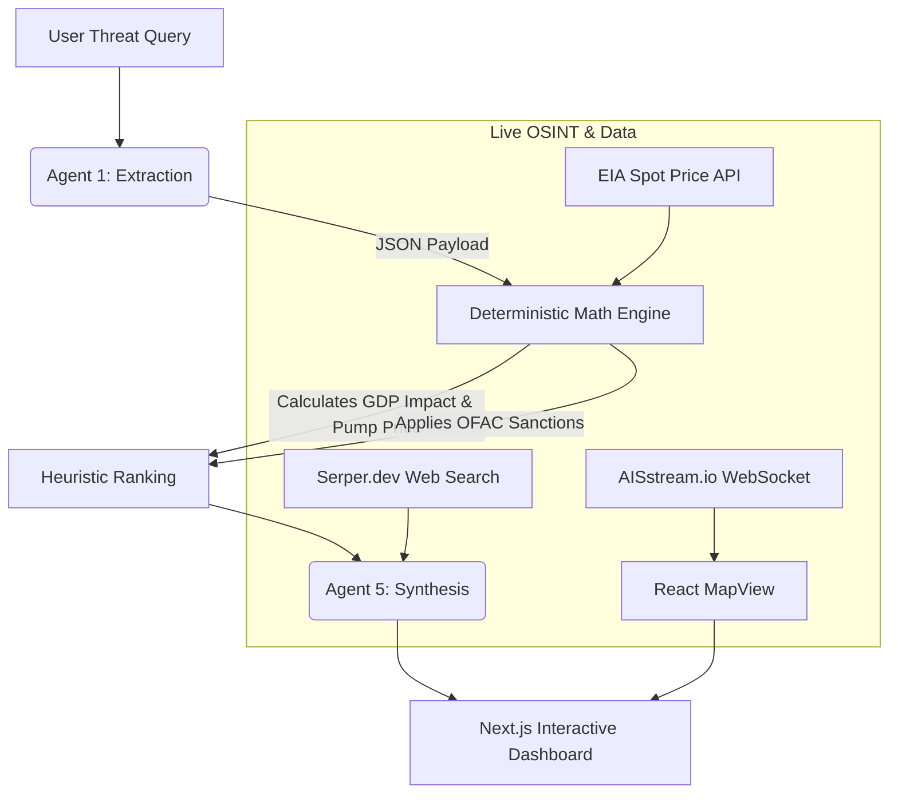

<div align="center">
  <h1>🛡️ ARGUS</h1>
  <p><strong>Deterministic Energy Supply Chain Resilience Engine & Intelligence Platform</strong></p>

  <p>
    
    
    
    
  </p>
</div>

---

## 📌 Strategic Overview
**ARGUS** is an advanced agentic intelligence platform designed for geopolitical risk analysts and strategic decision-makers. It dynamically models the cascading economic and supply-chain impacts of macro-level shocks to global maritime chokepoints (e.g., Strait of Hormuz, Bab el-Mandeb).

Rather than relying purely on generative LLM hallucinations, ARGUS utilizes a strict **Agentic-to-Deterministic Pipeline**: extracting unstructured threat signals, converting them to immutable mathematical states, computing real-world physics (e.g., SPR drawdowns, tanker lead times), and finally synthesizing the math back into a high-level strategic intelligence briefing.

## ✨ Core Capabilities

### 🚢 Live Maritime Intelligence
*   **Real-time AIS Tracking:** Integrates `AISstream.io` websockets to map live vessel traffic inside critical disruption corridors (e.g., Fujairah anchorages).
*   **Dark Zone Profiling:** Actively correlates missing AIS data with IMF PortWatch to "own" AIS sparsity as a deliberate transponder-suppression finding.

### 🧠 Multi-Agent Fallback Architecture
*   **Primary Engine:** Powered by NVIDIA NIM (`meta/llama-3.1-70b-instruct`) for rapid, high-accuracy extraction.
*   **Resilience Failover:** If the primary AI engine faults or hallucinates (e.g., JSON markdown wrapping), ARGUS automatically falls back to Groq (`llama-3.3-70b-versatile`), ensuring the dashboard **never** crashes during a crisis simulation.

### 📉 Mathematical Cascade Engine
*   **Dynamic Elasticity Math:** Converts raw volume loss (`mbd`) into dynamic supply-shock premiums.
*   **Heuristic Procurement Ranking:** Evaluates global oil alternatives based on Landed Cost, Lead Time, and Sanctions compliance, re-routing supply chains instantly.

### 🕵️ D-SHIELD: Adversarial Audit System
*   Every intelligence claim generated by ARGUS is challengeable. Users can click any synthesized sentence to launch an adversarial LLM audit (D-SHIELD), verifying the claim against the underlying mathematical state and extracting live sources.

---

## ⚙️ System Architecture



---

## 🚀 Installation & Deployment

### 1. Backend Setup (FastAPI)
Navigate to the backend directory and set up your virtual environment:

```bash
cd backend
python -m venv venv
source venv/Scripts/activate  # (Windows)
pip install -r requirements.txt
```

**Environment Variables (`backend/.env`):**
```env
NVIDIA_API_KEY=your_nvidia_key
GROQ_API_KEY=your_groq_key
SERPER_API_KEY=your_serper_key
EIA_KEY=your_eia_key
aistreamio_key=your_ais_key
```

**Run the Backend:**
```bash
uvicorn app.main:app --port 8000
```

### 2. Frontend Setup (Next.js)
Navigate to the frontend directory:

```bash
cd frontend
npm install
```

**Environment Variables (`frontend/.env.local`):**
```env
NEXT_PUBLIC_API_URL=http://127.0.0.1:8000
```

**Run the Frontend:**
```bash
npm run dev
```

The ARGUS Intelligence Dashboard will be accessible at `http://localhost:3000`.

---

## 🔒 Security & Resilience
* **API Protection:** Hardcoded APIs have been purged. Live OSINT (Serper) operates via in-memory caching to prevent rate-limit exhaustion during peak query surges.
* **Network Stability:** The AIS WebSocket relies on exponential backoff `while True` loops to survive server-side disconnections without dropping the client stream.
* **Data Integrity:** Strict regex filtering cleans markdown-wrapped JSON payloads, permanently fixing the notorious Llama 3 format-breaking bug.

> *"In geopolitical risk, confidence is nothing without calculation. ARGUS bridges the gap."*
