# ARGUS v3 — Complete Agent Architecture Reference

## Pipeline Execution Model

> [!IMPORTANT]
> **The pipeline runs SERIALLY, not in parallel.** Each agent awaits the previous one's output before starting. This is by design — each agent depends on the output of the one before it.

```mermaid
graph TD
    A0["Agent 0: Catalyst"] --> A1["Agent 1: Research"]
    A1 --> A2["Agent 2: Verification"]
    A2 --> A9["Agent 9: D-Shield"]
    A2 --> A4["Agent 4: Risk"]
    A4 --> A6["Agent 6: MCDA"]
    A6 --> FINAL["Assemble & Broadcast"]

    style A3 fill:#333,stroke:#f66,stroke-width:2px
    style A5 fill:#333,stroke:#f66,stroke-width:2px
    style A7 fill:#333,stroke:#f66,stroke-width:2px
    style A8 fill:#333,stroke:#f66,stroke-width:2px
    
    A3["Agent 3: Graph Builder ❌ NOT WIRED"]
    A5["Agent 5: Synthesizer ❌ NOT WIRED"]
    A7["Agent 7: Consensus ❌ NOT WIRED"]
    A8["Agent 8: ERASER ❌ NOT WIRED"]
    A10["Agent 10: RFQ ❌ NOT WIRED"]
```



### Currently Wired (in `server.py`): 0 → 1 → 2 → 9 → 4 → 6
### NOT Wired (exist as files but never called): 3, 5, 7, 8, 10

---

## Agent-by-Agent Breakdown

### Agent 0: Catalyst (Search Quality Gate) ✅ WORKING
| Property | Value |
|---|---|
| **File** | [agent_0_search_quality.py](file:///d:/c-files/my-project/ARGUS/agents/agent_0_search_quality.py) |
| **Signature** | `run_agent_0(user_input: str) -> Dict` |
| **LLM Calls** | 2 (entity extraction + query planning) |
| **Dependencies** | `core.reasoning`, `core.schemas`, `core.evidence_store` |

**Purpose**: Takes raw user text (e.g., "Taiwan semiconductor disruption") and extracts structured entities: `corridor`, `commodity`, `economy`, `crisis_type`. Then generates 3-5 search queries for Agent 1. Acts as a quality gate — rejects vague inputs with `status: REJECT`.

**Output Contract**:
```json
{
  "status": "PASS" | "REJECT",
  "corridor": "string | null",
  "commodity": "string | null", 
  "economy": "string | null",
  "crisis_type": "string | null",
  "generated_queries": ["query1", "query2", "query3"],
  "extraction_confidence": 0.0-1.0,
  "reasoning_trace": [...]
}
```

**Known Issues**: `corridor` can be `null` if the LLM can't infer one. Downstream agents must handle `None` corridor gracefully.

---

### Agent 1: Research & Retrieval ⚠️ HAS BUGS
| Property | Value |
|---|---|
| **File** | [agent_1_research.py](file:///d:/c-files/my-project/ARGUS/agents/agent_1_research.py) |
| **Signature** | `run_agent_1(corridor: str, commodity: str, economy: str, uploaded_files=None) -> Dict` |
| **LLM Calls** | 1 per relevant document (claim extraction) |
| **Dependencies** | `core.reasoning`, `core.schemas`, `core.evidence_store`, `core.scenarios`, `fitz` (PyMuPDF), `PIL`, `requests` |

**Purpose**: Collects documents from 3 sources: (1) local JSON articles, (2) scenario templates, (3) **live Serper web search**. Filters by keyword relevance, then uses LLM to extract structured claims with citations from each document.

**Output Contract**:
```json
{
  "claims": [Claim objects],
  "quarantined": [...],
  "total_documents": int,
  "relevant_documents": int,
  "stats": {...}
}
```

> [!CAUTION]
> **BUG 1 — Pydantic ValidationError**: LLM sometimes returns `null` for `claim_type`, `confidence`, or `excerpt`. The `Claim` model uses `Literal["numerical", "categorical", ...]` which crashes on `None`. **Partially fixed** with `str(... or "categorical")` for claim_type and safe float cast for confidence. But `value` field (expects `Optional[float]`) can still crash if LLM returns a non-numeric string.
>
> **BUG 2 — Keyword filter too strict**: Web search results from Serper were being silently dropped by the keyword filter. **Fixed** by bypassing filter for `source_type == "web_search"`.

---

### Agent 2: Source Verification ⚠️ HAS BUGS
| Property | Value |
|---|---|
| **File** | [agent_2_verification.py](file:///d:/c-files/my-project/ARGUS/agents/agent_2_verification.py) |
| **Signature** | `run_agent_2(claims: List[Dict]) -> Dict` |
| **LLM Calls** | 1 per claim (verification reasoning) |
| **Dependencies** | `core.reasoning`, `core.schemas`, `core.evidence_store`, `core.scenarios` |

**Purpose**: Takes raw claims from Agent 1 and cross-checks them against EIA baselines. Detects numerical variance (e.g., "claimed 15M b/d but EIA says 9.1M"). Assigns `VERIFIED`, `FLAGGED`, or `CONFLICTING` status.

**Output Contract**:
```json
{
  "verified_claims": [...],
  "flagged_claims": [...],
  "stats": {...}
}
```

> [!WARNING]
> **BUG**: `_claims_similar()` calls `.get("claim", "").lower()` but Agent 1's output uses the key `"text"` not `"claim"`. **Partially fixed** with fallback `c.get("claim", c.get("text", ""))`. Still fragile if both are `None`.

---

### Agent 3: Graph Builder ❌ NOT WIRED
| Property | Value |
|---|---|
| **File** | [agent_3_graph_builder.py](file:///d:/c-files/my-project/ARGUS/agents/agent_3_graph_builder.py) |
| **Signature** | `run_agent_3(verified_claims: List[Dict]) -> Dict` |
| **LLM Calls** | 0 (pure rule-based entity extraction + NetworkX) |
| **Dependencies** | `networkx`, `core.schemas`, `core.evidence_store` |

**Purpose**: Builds a NetworkX semantic graph from verified claims. Extracts entities (corridors, suppliers, refineries, ports) and creates typed edges (SUPPLIES_VIA, ROUTES_TO, DEPENDS_ON). Computes graph analytics (density, centrality). Persists graph to `data/argus_graph.json`.

**Status**: Code is clean, no enum bugs. **Not called from `server.py`**. Should be wired after Agent 2.

---

### Agent 4: Risk Analyzer ⚠️ HAS BUGS
| Property | Value |
|---|---|
| **File** | [agent_4_risk.py](file:///d:/c-files/my-project/ARGUS/agents/agent_4_risk.py) |
| **Signature** | `run_agent_4(verified_claims, graph_data, corridor, commodity, economy) -> Dict` |
| **LLM Calls** | 5 (one per risk component) |
| **Dependencies** | `core.reasoning`, `core.schemas`, `core.evidence_store`, `core.satellite` |

**Purpose**: Implements the Cambridge Supply Chain Risk Formula with 5 weighted components (Exposure Breadth 35%, Dependency Ratio 25%, Downstream Criticality 20%, Tier1 Centrality 10%, Exposure Depth 10%). Each component is LLM-estimated from evidence. Produces a 0-1 risk score.

**Output Contract**:
```json
{
  "risk_score": 0.0-1.0,
  "risk_level": "HIGH" | "MEDIUM" | "LOW",
  "components": [{name, value, weight, contribution, reasoning}],
  "satellite_intelligence": {...}
}
```

> [!CAUTION]
> **BUG (FIXED)**: `SourceTier.INTERNAL` and `EvidenceType.INTERNAL` don't exist in the enum. Changed to `.UNKNOWN` / `.USER_PROVIDED`.
>
> **BUG (FIXED)**: `corridor.lower()` crashed when corridor is `None`. Fixed in `core/satellite.py` with safe cast.

---

### Agent 5: CSCO Synthesizer ❌ NOT WIRED — HAS ENUM BUG
| Property | Value |
|---|---|
| **File** | [agent_5_synthesizer.py](file:///d:/c-files/my-project/ARGUS/agents/agent_5_synthesizer.py) |
| **Signature** | `run_agent_5(verified_claims, risk_output, flagged_claims, corridor, commodity, economy) -> Dict` |
| **LLM Calls** | 1 (narrative generation) |
| **Dependencies** | `core.reasoning`, `core.schemas`, `core.evidence_store` |

**Purpose**: Generates a CSCO (Chief Supply Chain Officer) narrative briefing with mandatory citation enforcement. Every factual sentence must end with `[source: URL]`.

> [!CAUTION]
> **WILL CRASH**: Uses `EvidenceType.SYNTHESIS` (line 177) which **does not exist** in the enum. Also uses `claim_type="narrative"` which is **not in the Literal** (`numerical|categorical|trend|event|policy|forecast`). Both will throw Pydantic validation errors.

---

### Agent 6: MCDA Alternative Sourcing ⚠️ HAS BUGS (FIXED)
| Property | Value |
|---|---|
| **File** | [agent_6_mcda.py](file:///d:/c-files/my-project/ARGUS/agents/agent_6_mcda.py) |
| **Signature** | `run_agent_6(verified_claims, graph_data, corridor, commodity, economy) -> Dict` |
| **LLM Calls** | 1 (alternative discovery) |
| **Dependencies** | `core.reasoning`, `core.schemas`, `core.evidence_store`, `numpy` |

**Purpose**: Discovers alternative sourcing options via LLM, then ranks them using TOPSIS MCDA (Technique for Order Preference by Similarity to Ideal Solution) with sensitivity analysis.

**Bugs Fixed**: `SourceTier.INTERNAL` → `.UNKNOWN`, `EvidenceType.INTERNAL` → `.USER_PROVIDED`.

---

### Agent 7: Consensus & Conflict Detector ❌ NOT WIRED — HAS ENUM BUG
| Property | Value |
|---|---|
| **File** | [agent_7_consensus.py](file:///d:/c-files/my-project/ARGUS/agents/agent_7_consensus.py) |
| **Signature** | `run_agent_7(risk_output, verified_claims, mcda_output, flagged_claims, corridor, commodity, economy) -> Dict` |
| **LLM Calls** | 1 (semantic comparison) |

**Purpose**: Compares Agent 4 (Risk) vs Agent 6 (MCDA) outputs semantically. Determines if they agree or conflict. Can halt the pipeline if conflict is detected.

> [!CAUTION]
> **BUG (FIXED)**: `SourceTier.INTERNAL` → `.UNKNOWN`, `EvidenceType.INTERNAL` → `.USER_PROVIDED`. Also `claim_type="consensus"` is **not valid** — will crash Pydantic.

---

### Agent 8: ERASER (Epistemic Audit) ❌ NOT WIRED — HAS ENUM BUG
| Property | Value |
|---|---|
| **File** | [agent_8_eraser.py](file:///d:/c-files/my-project/ARGUS/agents/agent_8_eraser.py) |
| **Signature** | `run_agent_8(pipeline_state: Dict) -> Dict` |
| **LLM Calls** | 1 (full pipeline audit) |

**Purpose**: PolitiFact-style audit of the entire pipeline. Answers 8 ERASER questions for each agent. Produces an overall credibility rating.

> [!CAUTION]
> **BUG (FIXED)**: `SourceTier.INTERNAL` → `.UNKNOWN`, `EvidenceType.INTERNAL` → `.USER_PROVIDED`. Also `claim_type="audit"` is **not valid**.

---

### Agent 9: Disinformation Shield ⚠️ PARTIALLY WIRED
| Property | Value |
|---|---|
| **File** | [agent_9_dshield.py](file:///d:/c-files/my-project/ARGUS/agents/agent_9_dshield.py) |
| **Signature** | `run_agent_9(verified_claims, flagged_claims) -> Dict` |
| **LLM Calls** | 0 (rule-based domain whitelist check) |

**Purpose**: Checks if claims come from official domains (EIA, IEA, Reuters, etc.). Quarantines claims from unofficial sources.

**Status**: The actual `run_agent_9()` function is **never called** from `server.py`. Instead, server.py has an inline simplified version (lines 182-196) that just reformats flagged claims. The real agent does more (checks verified claims too).

---

### Agent 10: RFQ Generator ❌ NOT WIRED
| Property | Value |
|---|---|
| **File** | [agent_10_rfq.py](file:///d:/c-files/my-project/ARGUS/agents/agent_10_rfq.py) |
| **Signature** | `run_agent_10(alternatives: List[Dict], context: Dict) -> Dict` |
| **LLM Calls** | 0 (template-based) |

**Purpose**: Takes the top MCDA alternative and generates an RFQ (Request for Quotation) document. Pure template, no LLM.

**Status**: Clean code, no bugs. Just not wired.

---

## Global Bug Summary

| Bug | Location | Impact | Status |
|---|---|---|---|
| `SourceTier.INTERNAL` doesn't exist | Agent 4, 6, 7, 8 | **Crash** — AttributeError | ✅ Fixed in 4, 6, 7, 8 |
| `EvidenceType.INTERNAL` doesn't exist | Agent 4, 6, 7, 8 | **Crash** — AttributeError | ✅ Fixed in 4, 6, 7, 8 |
| `EvidenceType.SYNTHESIS` doesn't exist | Agent 5 | **Will crash** when wired | ❌ Not fixed |
| `claim_type="narrative"` invalid | Agent 5 | **Will crash** — Pydantic Literal error | ❌ Not fixed |
| `claim_type="consensus"` invalid | Agent 7 | **Will crash** — Pydantic Literal error | ❌ Not fixed |
| `claim_type="audit"` invalid | Agent 8 | **Will crash** — Pydantic Literal error | ❌ Not fixed |
| LLM returns `null` for claim fields | Agent 1 | **Crash** — Pydantic validation | ⚠️ Partially fixed |
| `corridor` is `None` | Agent 4 (satellite.py) | **Crash** — NoneType.lower() | ✅ Fixed |
| Wrong arg count in server.py calls | Agent 1, 4, 6 | **Crash** — TypeError | ✅ Fixed |
| Agent 9 not properly called | server.py | Uses inline stub, not real agent | ⚠️ Functional but incomplete |

## Ideal Full Pipeline Order (Once All Wired)

```
Agent 0 (Catalyst)     → Entity extraction, query planning
Agent 1 (Research)     → Live web search + local data + claim extraction  
Agent 2 (Verification) → Cross-reference claims against baselines
Agent 3 (Graph)        → Build semantic network from verified claims
Agent 9 (D-Shield)     → Quarantine disinformation
Agent 4 (Risk)         → Cambridge weighted risk formula (uses graph data)
Agent 6 (MCDA)         → Alternative sourcing TOPSIS ranking
Agent 7 (Consensus)    → Compare Risk vs MCDA for agreement
Agent 5 (Synthesizer)  → Generate CSCO narrative briefing
Agent 8 (ERASER)       → Full pipeline audit
Agent 10 (RFQ)         → Generate procurement document
```

> Agents 4 and 6 could potentially run **in parallel** since they both depend on Agent 2's output but not on each other. Agent 7 must wait for both 4 and 6. This is a future optimization.

---

## Complete UI Overhaul (Professional Report Interface)

The original dashboard was a simple grid with sliders and generic components, which failed to meet the professional intelligence standard required for this project. Following the `ui-ux-pro-max` guidelines, the interface has been completely redesigned into a **Scrollable Intelligence Report**.

### Key UI/UX Enhancements:
1. **Report-Style Layout**: Replaced the dashboard grid with a single-column, scrollable report (similar to a PDF briefing or professional news article) for linear readability.
2. **HitL (Human-in-the-Loop) Interactivity**: 
   - Every verified claim now features an inline "Question" button.
   - Users can challenge a claim's evidence, methodology, or source reliability directly.
   - These questions are logged back to the owning agent via the `/api/feedback` endpoint, creating a robust audit trail.
3. **Inline Citations & Confidence**: Claims display their originating agent, confidence score (color-coded), and clickable source URLs immediately below the text.
4. **Data Visualization**: Risk charts (Ripple Contagion) and MCDA alternative rankings are seamlessly embedded within the report sections.
5. **Comprehensive Briefing**: The final UI now renders the CSCO Narrative (Agent 5), Automated RFQ Draft (Agent 10), and ERASER Audit (Agent 8) directly on the screen as structured sections.

---

## Session Handover Notes (For Next AI Assistant)
During the latest debugging session, the following critical architecture blockers were resolved:
- **Enum Pydantic Crashes**: Fixed `ClaimStatus.VERIFIED` casing mismatch, missing `ClaimStatus` imports, and invalid EvidenceType/ClaimType Literals that caused silent failures in Agents 3, 4, 5, 7, and 8.
- **Agent Wiring**: Previously, Agents 3, 5, 7, 8, and 10 were "orphaned" (not called in `server.py`). They are now successfully wired into `run_pipeline_streamed()` and execute serially.
- **File System Stability**: Resolved `NoneType` attribute errors on empty strings (Agent 5) and missing directory creation exceptions for `export_trail()` in Agent 8.
- **Data Flow Integration**: Modified `server.py` to collect `.pdf` files from `UPLOADS_DIR` and dynamically pass them into Agent 1.
- **Frontend Presentation**: Discarded the fragmented dashboard for a unified, scrollable intelligence briefing with active Human-in-the-Loop questioning for every extracted claim. The `/api/export-pdf` route was also updated to generate reports including the generated narrative and RFQ.
- **Git Branching**: Unified the repository state back onto the `master` branch.
